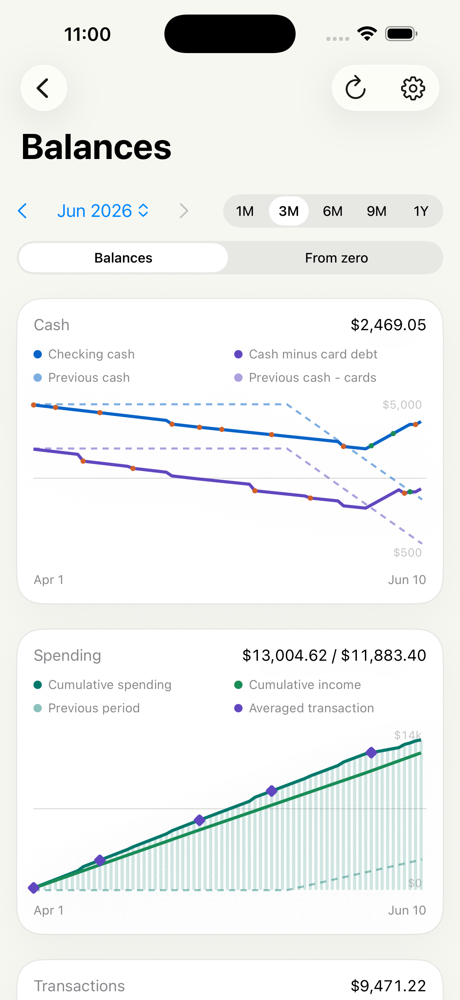
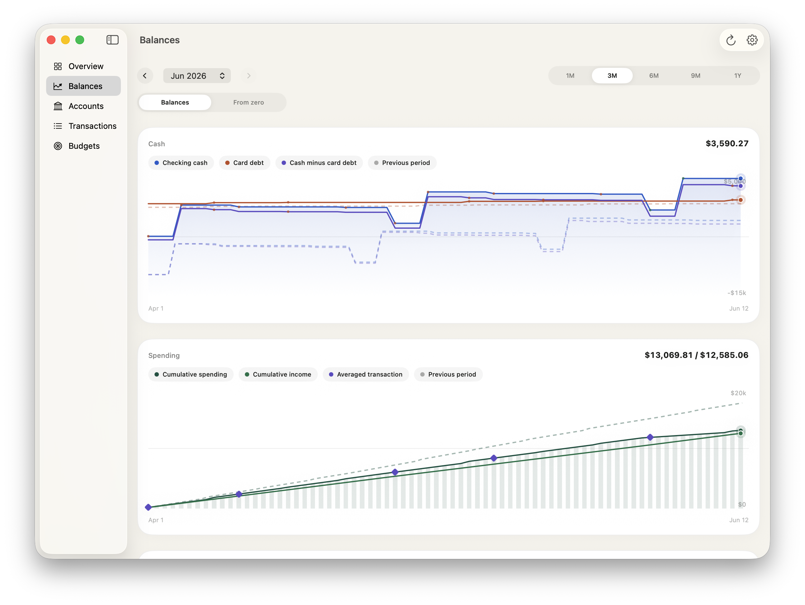

# BudgetTracer

BudgetTracer is a paired iOS and macOS budgeting app for understanding cash, card debt, spending, income, and recurring monthly budget pressure from connected financial data. The product uses one shared Swift domain and SwiftUI surface across Apple platforms, with thin platform app shells.

Current release: `1.1.0` build `2`.

## Screenshots

### iOS



### macOS



## App Surfaces

- `Overview`: cash, card debt, income, spending, and recent transactions.
- `Balances`: normalized checking cash, cash minus card debt, previous-period balance traces, cumulative spending, cumulative income, and transaction-time spending.
- `Accounts`: account classification controls for cash, savings, investments, cards, and exclusions.
- `Transactions`: searchable transaction ledger with recurring monthly controls.
- `Budgets`: category-level budget structure.

The Balances screen supports `1M`, `3M`, `6M`, `9M`, and `1Y` ranges. Checking cash is the default cash basis; investments and funds, including money market accounts, are excluded from checking cash unless the user changes account classifications.

## Architecture

- `BudgetCore`: shared money, account, transaction, category, summary, and projection models.
- `BudgetPersistence`: SQLite schema, migrations, repositories, transaction/account persistence, sync cursors, and user annotations.
- `BudgetPlaid`: Plaid API client, Link token creation, public-token exchange, `/transactions/sync`, and Plaid-to-domain mapping.
- `BudgetTracerSharedUI`: shared SwiftUI app screens and workspace state.
- `BudgetTracerBackend`: local loopback backend for Plaid and persistence development.
- `BudgetTracerMac`: SwiftPM macOS executable shell for fast local iteration.
- `Apps/BudgetTraceriOS` and `Apps/BudgetTracerMac`: Xcode app lifecycle shells.

The generated Xcode project is checked in at `BudgetTracer.xcodeproj`, with `project.yml` as the source of truth for target structure and shared build settings.

## Local Development

Build and run the macOS shell in demo mode, with no Plaid or Keychain access:

```bash
./script/run_local_stack.sh
```

Run tests:

```bash
swift test
```

Build both Xcode app targets:

```bash
./script/build_xcode_apps.sh
```

Regenerate the Xcode project after changing target structure:

```bash
./script/generate_xcode_project.sh
```

The Xcode schemes default to demo data:

```text
BUDGETTRACER_USE_BACKEND=0
```

Set `BUDGETTRACER_USE_BACKEND=1` only when intentionally testing the Plaid-backed local backend.

## Plaid And Backend

BudgetTracer keeps Plaid behind backend and provider boundaries:

- Apple clients ask the backend for Link tokens and never store raw Plaid access tokens.
- The backend exchanges public tokens and owns Plaid `/transactions/sync`.
- The local database stores `access_token_ref`; raw tokens live in a token vault.
- Local sandbox development defaults to file-backed secrets under `~/.budgettracer/secrets/` to avoid repeated Keychain prompts.

Useful backend scripts:

```bash
./script/run_backend.sh --background
./script/backend_smoke.sh
./script/plaid_sandbox_smoke.sh
./script/plaid_sandbox_e2e.sh
./script/run_plaid_stack.sh
./script/run_backend.sh --stop
```

Implemented local backend routes:

- `GET /health`
- `GET /snapshot` for cached reads, with optional `freshness=sync_if_stale&max_age_seconds=300` or `freshness=force_sync`
- `POST /plaid/link-token`
- `POST /plaid/exchange-public-token`
- `POST /plaid/sandbox/create-item`
- `POST /plaid/sync`
- `POST /plaid/webhook`
- `PATCH /transactions/regular-monthly`

## CI And Releases

GitHub Actions runs `swift test` and `./script/build_xcode_apps.sh` for pushes to `main` and pull requests.

Publishing is not automated yet. A release pipeline still needs signing assets, provisioning profiles, App Store Connect credentials, and an explicit archive/export/notarization strategy before CI can publish iOS or macOS builds.

## Documentation

- [Changelog](CHANGELOG.md)
- [Xcode app targets](docs/xcode-app-targets.md)
- [Local Plaid secrets](docs/local-plaid-secrets.md)
- [Backend deployment](docs/backend-deployment.md)
- [Cloudflare Worker Plaid relay](docs/cloudflare-worker.md)
- [ADR 0001: Shared SwiftUI Apple Platform Architecture](docs/adr/0001-shared-swiftui-apple-platform-architecture.md)
- [ADR 0002: Plaid Sync and Financial Database](docs/adr/0002-plaid-sync-and-financial-database.md)
- [ADR 0003: Secure Local App Store Storage](docs/adr/0003-secure-local-app-store-storage.md)

## License

BudgetTracer is available under the [MIT License](LICENSE).
